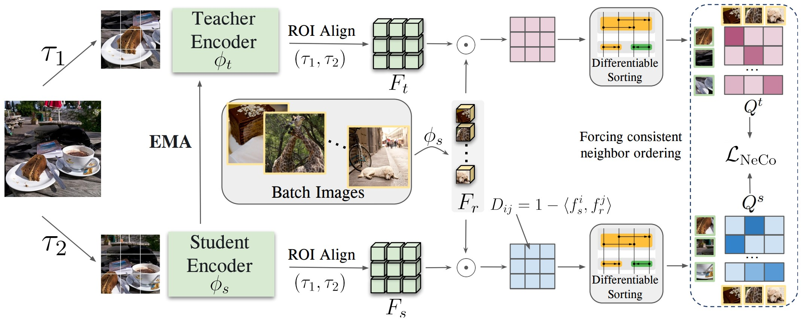
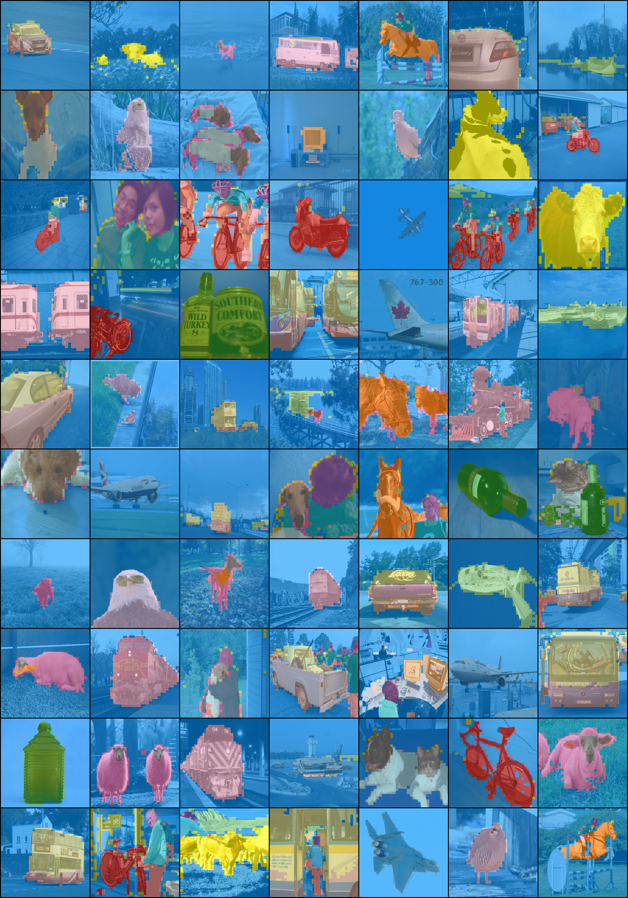

#  [`Near, far: Patch-ordering enhances vision foundation models' scene understanding`](https://arxiv.org/abs/2408.11054)

*[Valentinos Pariza*](https://vpariza.github.io), [Mohammadreza Salehi*](https://smsd75.github.io),[Gertjan J. Burghouts](https://gertjanburghouts.github.io), [Francesco Locatello](https://www.francescolocatello.com/), [Yuki M. Asano](https://yukimasano.github.io)* 

### [ICLR 2025](https://openreview.net/forum?id=Qro97zWC29)

🌐 **[Project Page](https://vpariza.github.io/NeCo/)** / ⌨️ **[GitHub Repository](https://github.com/vpariza/NeCo)** / 📄 **[Read the Paper on arXiv](https://arxiv.org/abs/2408.11054)**
## Table of Contents

- [News](#news)
- [Introduction](#introduction)
- [GPU Requirements](#gpu-requirements)
- [Environment Setup](#environment-setup)
- [Loading pretrained models](#loading-pretrained-models)
- [Training](#training-setup)
- [Evaluation](#evaluation)
- [Dataset Preparation](#datasets)
- [Visualizations](#visualizations)
- [Citation](#citation)
- [License](#license)

## News
Thank you for using our code. Here we include news about changes in the repository.
1. The repository has changed substantially to upgrade libraries to more recent libraries that speed up execution and reduce memory usage especially for the `v2` ViT architecture that is used by Dinov2. The boost in the latter architecture comes by the use of xformers just like Dinov2 training.
2. We updated the table below with new model entries and have added post-training config files, for dinov2, and dinov2r with and without the use of registers.
3. We have clarified how each model is trained by explicitly providing a config file next to each model we post-trained in the table below.
4. We have added code for linear segmentation for the Cityscapes Dataset.
5. We cleared the code more and added more flexibility on what can be used during training via the configuration in files. More specifically added the following parameters:
   * `eval_attn_maps` (True/False) for specifying whether to evaluate the attention maps during training.
   * `num_register_tokens` (int: default to 0) for specifying whether to use registers and how much. Only works with architecture `v2`.
   

If you are interested for the legacy code, please look our github branch [neco-1_x](https://github.com/vpariza/NeCo/tree/neco-1_x).

## Introduction

NeCo introduces a new self-supervised learning technique for enhancing spatial representations in vision transformers. By leveraging Patch Neighbor Consistency, NeCo captures fine-grained details and structural information that are crucial for various downstream tasks, such as semantic segmentation.

<p align="center">
  
</p>


Key features of NeCo include:
1. Patch-based neighborhood consistency
2. Improved dense prediction capabilities
3. Efficient training requiring only 19 GPU hours
4. Compatibility with existing vision transformer backbone


Below is a table with some of our results on Pascal VOC 2012 based on DINOv2 backbone. 
<table>
  <tr>
    <th>backbone</th>
    <th>arch</th>
    <th>params</th>
    <th>Overclustering k=500</th>
    <th>Dense NN Retrieval</th>
    <th>linear</th>
    <th colspan="2">download</th>
    <th>config</th>
  </tr>
  <tr>
    <td>DINOv2</td>
    <td>ViT-S/14</td>
    <td>21M</td>
    <td>57.7</td>
    <td>78.6</td>
    <td>81.4</td>
    <td><a href="https://huggingface.co/FunAILab/NeCo/resolve/main/vit-small/dinov2-architectures/neco_on_dinov2_vit14_model.ckpt">student</a></td>
    <td><a href="https://huggingface.co/FunAILab/NeCo/resolve/main/vit-small/dinov2-architectures/neco_on_dinov2_vit14_teacher.ckpt">teacher</a></td>
    <td><a href="./experiments/configs/models/small/neco_dinov2.yml">config</a></td>
  </tr>
  <tr>
    <td>DINOv2R-XR</td>
    <td>ViT-S/14</td>
    <td>21M</td>
    <td>72.6</td>
    <td>80.2</td>
    <td>81.3</td>
    <td><a href="https://huggingface.co/FunAILab/NeCo/resolve/main/vit-small/dinov2-architectures/neco_on_dinov2r_xr_vit14_model.ckpt">student</a></td>
    <td><a href="https://huggingface.co/FunAILab/NeCo/resolve/main/vit-small/dinov2-architectures/neco_on_dinov2r_xr_vit14_teacher.ckpt">teacher</a></td>
    <td><a href="./experiments/configs/models/small/neco_dinov2r_xr.yml">config</a></td>
  </tr>
  <tr>
    <td>DINOv2R</td>
    <td>ViT-S/14</td>
    <td>21M</td>
    <td>68.9</td>
    <td>80.7</td>
    <td>81.5</td>
    <td><a href="https://huggingface.co/FunAILab/NeCo/resolve/main/vit-small/dinov2-architectures/neco_on_dinov2r_vit14_model.ckpt">student</a></td>
    <td><a href="https://huggingface.co/FunAILab/NeCo/resolve/main/vit-small/dinov2-architectures/neco_on_dinov2r_vit14_teacher.ckpt">teacher</a></td>
    <td><a href="./experiments/configs/models/small/neco_dinov2r.yml">config</a></td>
  </tr>
  <tr>
    <td>DINOv2</td>
    <td>ViT-B/14</td>
    <td>85M</td>
    <td>71.1</td>
    <td>82.8</td>
    <td>84.5</td>
    <td><a href="https://huggingface.co/FunAILab/NeCo/resolve/main/vit-base/dinov2-architectures/neco_on_dinov2_vit14_model.ckpt">student</a></td>
    <td><a href="https://huggingface.co/FunAILab/NeCo/resolve/main/vit-base/dinov2-architectures/neco_on_dinov2_vit14_teacher.ckpt">teacher</a></td>
    <td><a href="./experiments/configs/models/base/neco_dinov2.yml">config</a></td>
  </tr>
  <tr>
    <td>DINOv2R-XR</td>
    <td>ViT-B/14</td>
    <td>85M</td>
    <td>71.8</td>
    <td>83.5</td>
    <td>83.3</td>
    <td><a href="https://huggingface.co/FunAILab/NeCo/resolve/main/vit-base/dinov2-architectures/neco_on_dinov2r_xr_vit14_model.ckpt">student</a></td>
    <td><a href="https://huggingface.co/FunAILab/NeCo/resolve/main/vit-base/dinov2-architectures/neco_on_dinov2r_xr_vit14_teacher.ckpt">teacher</a></td>
    <td><a href="./experiments/configs/models/base/neco_dinov2r_xr.yml">config</a></td>
  </tr>
  <tr>
    <td>DINOv2R</td>
    <td>ViT-S/14</td>
    <td>85M</td>
    <td>71.9</td>
    <td>82.9</td>
    <td>84.4</td>
    <td><a href="https://huggingface.co/FunAILab/NeCo/resolve/main/vit-base/dinov2-architectures/neco_on_dinov2r_vit14_model.ckpt">student</a></td>
    <td><a href="https://huggingface.co/FunAILab/NeCo/resolve/main/vit-base/dinov2-architectures/neco_on_dinov2r_vit14_teacher.ckpt">teacher</a></td>
    <td><a href="./experiments/configs/models/base/neco_dinov2r.yml">config</a></td>
  </tr>
  <tr>
    <td>DINO</td>
    <td>ViT-S/16</td>
    <td>22M</td>
    <td>47.9</td>
    <td>61.3</td>
    <td>65.8</td>
    <td><a href="https://huggingface.co/FunAILab/NeCo/resolve/main/vit-small/dino-architectures/neco_on_dino_vit16_model.ckpt">student</a></td>
    <td><a href="https://huggingface.co/FunAILab/NeCo/resolve/main/vit-small/dino-architectures/neco_on_dino_vit16_teacher.ckpt">teacher</a></td>
    <td><a href="./experiments/configs/models/small/neco_dino.yml">config</a></td>
  </tr>
  <tr>
    <td>TimeT</td>
    <td>ViT-S/16</td>
    <td>22M</td>
    <td>53.1</td>
    <td>66.5</td>
    <td>68.5</td>
    <td><a href="https://huggingface.co/FunAILab/NeCo/resolve/main/vit-small/dino-architectures/neco_on_timetuning_vit16_model.ckpt">student</a></td>
    <td><a href="https://huggingface.co/FunAILab/NeCo/resolve/main/vit-small/dino-architectures/neco_on_timetuning_vit16_teacher.ckpt">teacher</a></td>
    <td><a href="./experiments/configs/models/small/neco_timetuning.yml">config</a></td>
  </tr>
  <tr>
    <td>Leopart</td>
    <td>ViT-S/16</td>
    <td>22M</td>
    <td>55.3</td>
    <td>66.2</td>
    <td>68.3</td>
    <td><a href="https://huggingface.co/FunAILab/NeCo/resolve/main/vit-small/dino-architectures/neco_on_leopart_vit16_model.ckpt">student</a></td>
    <td><a href="https://huggingface.co/FunAILab/NeCo/resolve/main/vit-small/dino-architectures/neco_on_leopart_vit16_teacher.ckpt">teacher</a></td>
    <td><a href="./experiments/configs/models/small/neco_leopart.yml">config</a></td>
  </tr>
</table>

In the following sections, we will delve into the training process, evaluation metrics, and provide instructions for using NeCo in your own projects.

## GPU Requirements
Optimizing with our model, ***NeCo***, does not necessitate a significant GPU budget. Our training process is conducted on a single NVIDIA A100 GPU.


## Environment Setup
We use conda for dependency management. 
Please use `environment.yml` to install the environment necessary to run everything from our work. 
You can install it by running the following command:
```bash
conda env create -f environment.yaml
```
Or you can see the step by step process in the [Installation Guide](INSTALLATION.md) guide.

#### Pythonpath
Export the module to PYTHONPATH within the repository's parent directory.
`
export PYTHONPATH="${PYTHONPATH}:$PATH_TO_REPO"
`
#### Neptune
We use neptune for logging experiments.
Get you API token for neptune and insert it in the corresponding run-files.
Also make sure to adapt the project name when setting up the logger.


## Loading pretrained models

To use NeCo models on downstream dense prediction tasks, you just need to install `timm`  and `torch` and depending on which checkpoint you use you can load it as follows:

The models can be download from our [NeCo Hugging Face repo](https://huggingface.co/FunAILab/NeCo/tree/main).

### Models after post-training dinov2 (following dinov2 architecture)
* Models that can be loaded with this approach can be found at the hugging face page:
  * [vit-small models](https://huggingface.co/FunAILab/NeCo/tree/main/vit-small/dinov2-architectures)
  * [vit-base models](https://huggingface.co/FunAILab/NeCo/tree/main/vit-base/dinov2-architectures)
#### NeCo on Dinov2 
```python
import torch
# change to dinov2_vitb14 for base as described in:
#    https://github.com/facebookresearch/dinov2
model =  torch.hub.load('facebookresearch/dinov2', 'dinov2_vits14') 
path_to_checkpoint = "<your path to downloaded ckpt>"
state_dict = torch.load(path_to_checkpoint)
model.load_state_dict(state_dict, strict=False)
```
#### NeCo on Dinov2 with Registers
```python
import torch
# change to dinov2_vitb14_reg for base as described in:
#    https://github.com/facebookresearch/dinov2
model =  torch.hub.load('facebookresearch/dinov2', 'dinov2_vits14_reg') 
path_to_checkpoint = "<your path to downloaded ckpt>"
state_dict = torch.load(path_to_checkpoint)
model.load_state_dict(state_dict, strict=False)
```
### Models after post-training dino or similar (following dino architecture)
* Models that can be loaded with this approach can be found at the hugging face page:
  * [vit-small models](https://huggingface.co/FunAILab/NeCo/tree/main/vit-small/dino-architectures)
  * [vit-bas emodels](https://huggingface.co/FunAILab/NeCo/tree/main/vit-base/dino-architectures)
#### timm vit-small and vit-base architectures
```python
import torch
from timm.models.vision_transformer import vit_small_patch16_224, vit_base_patch16_224
# Change to vit_base_patch8_224() if you want to use our larger model
model = vit_small_patch16_224()  
path_to_checkpoint = "<your path to downloaded ckpt>"
state_dict = torch.load(path_to_checkpoint, map_location='cpu')
model.load_state_dict(state_dict, strict=False)
```

**Note:** In case you want to directly load the weights of the model from a hugging face url, please execute:
```python
import torch
state_dict = torch.hub.load_state_dict_from_url("<url to the hugging face checkpoint>")
```


## Training Setup

### Repository Structure

- `src/`: Model, method, and transform definitions
- `experiments/`: Scripts for setting up and running experiments
- `data/`: Data modules for ImageNet, COCO, Pascal VOC, and ADE20k

### Training with NeCo

- Use configs in `experiments/configs/` to reproduce our experiments
- Modify paths in config files to match your dataset and checkpoint directories
- For new datasets:
  1. Change the data path in the config
  2. Add a new data module
  3. Initialize the new data module in `experiments/train_with_neco.py`

For instance, to start a training on COCO:

```bash
python experiments/train_with_neco.py --config_path experiments/configs/neco_224x224.yml
```

## Evaluation

We provide several evaluation scripts for different tasks. For detailed instructions and examples, please refer to the [Evaluation README](evaluation_README.md). Here's a summary of the evaluation methods:

1. **Linear Segmentation**: 
   - Use `linear_finetune.py` for fine-tuning.
   - Use `eval_linear.py` for evaluating on the validation dataset.

2. **Overclustering**:
   - Use `eval_overcluster.py` to evaluate overclustering performance.

3. **Cluster Based Foreground Extraction + Community Detection (CBFE+CD)**:
   - Requires downloading noisy attention train and val masks.
   - Provides examples for both ViT-Small and ViT-Base models.

Each evaluation method has specific configuration files and command-line arguments. The Evaluation README provides detailed examples and instructions for running these evaluations on different datasets and model architectures.


## Datasets

We use PyTorch Lightning data modules for our datasets. Supported datasets include ImageNet100k, COCO, Pascal VOC, ADE20k, and Cityscapes. Each dataset requires a specific folder structure for proper functioning.

Data modules are located in the `data/` directory and handle loading, preprocessing, and augmentation. When using these datasets, ensure you update the paths in your configuration files to match your local setup.

For detailed information on dataset preparation, download instructions, and specific folder structures, please refer to the [Dataset README](DATASET.md).


##  Visualizations

We provide visualizations to help understand the performance of our method. Below is an example of Cluster-Based Foreground Extraction (CBFE) results on the Pascal VOC dataset:



This visualization shows the ability of NeCo without relying on any supervision. Different objects are represented by distinct colors, and the method captures tight and precise object boundaries.

## Citations

<a name="citation"> </a>

If you find this repository useful, please consider giving a star ⭐ and citation 📣:
``` 
@inproceedings{
   pariza2025near,
   title={Near, far: Patch-ordering enhances vision foundation models' scene understanding},
   author={Valentinos Pariza and Mohammadreza Salehi and Gertjan J. Burghouts and Francesco Locatello and Yuki M Asano},
   booktitle={The Thirteenth International Conference on Learning Representations},
   year={2025},
   url={https://openreview.net/forum?id=Qro97zWC29}
}

```

## License
<a name="license"> </a>
All our code is MIT license with the exception of DINOv2 related code that follows `Apache 2 license`.
DINOv2 has an Apache 2 license [DINOv2](https://github.com/facebookresearch/dinov2/blob/main/LICENSE).

#### Note: Our repository is developed by adopting and adapting multiple parts of the [Leopart](https://github.com/MkuuWaUjinga/leopart) model, as well as parts from other works like DINOv2, DINO, R-CNN, ...


